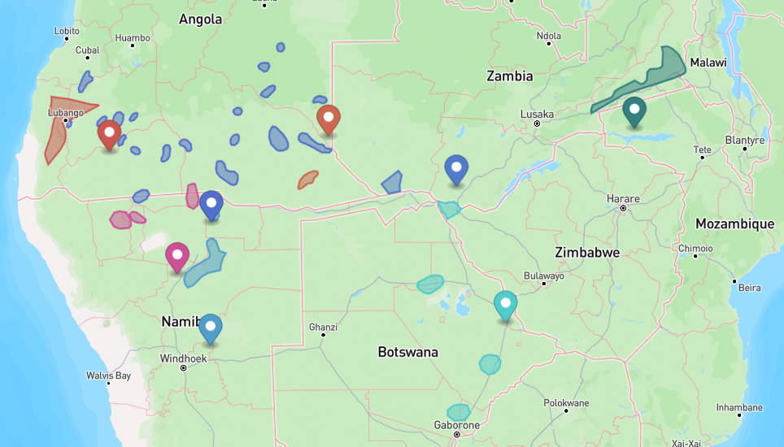
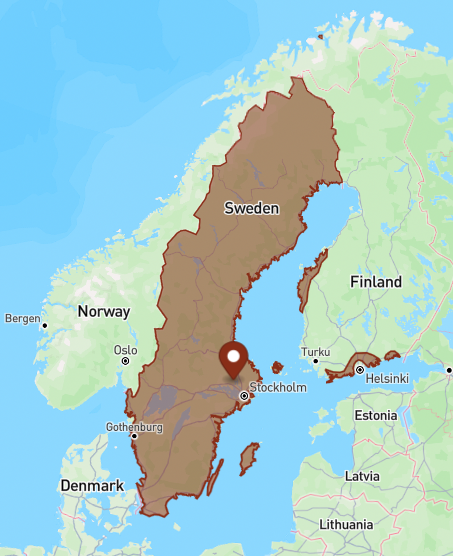
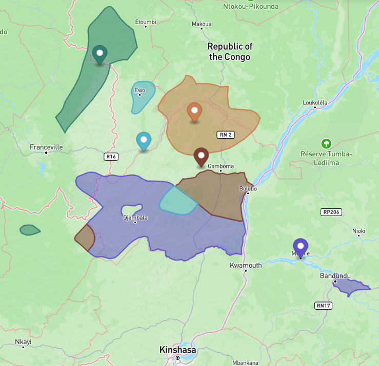
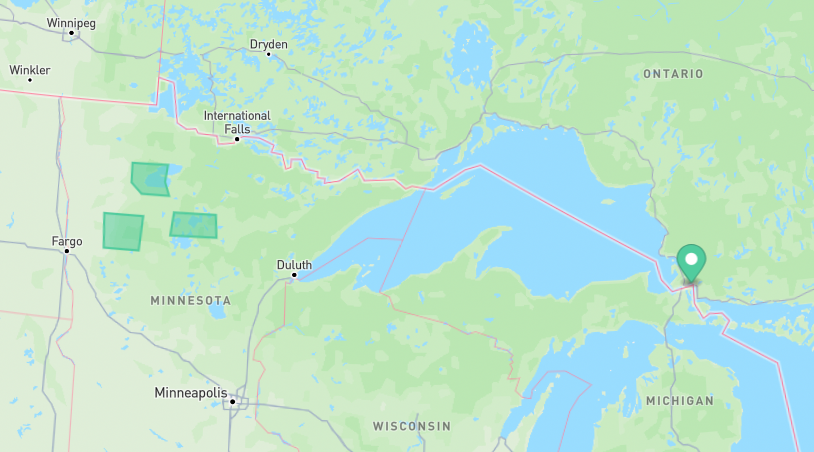

# Releasing the dataset

In case of upstream changes in glottography-data we have to recreate the GeoJSON dataset in `raw/`
and`metadata.json`, running
```shell
cldfbench download cldfbench_asher2007world.py
```

Now we can recreate the CLDF datasets:
```shell
cldfbench makecldf cldfbench_asher2007world.py --glottolog-version v5.1
```

This creates **two** CLDF datasets, one with *traditional* speaker areas, and one with *contemporary*
areas.


## Validation


### The *traditional* areas

Run CLDF validation and validation of geometries:
```shell
cldf validate cldf/traditional
cldfbench geojson.validate cldf/traditional
```

#### Glottolog distance

Compute distances of language-level speaker areas to corresponding Glottolog point coordinate:
```shell
cldfbench geojson.glottolog_distance cldf/traditional --format tsv | csvformat -t > etc/traditional/glottolog_distance.csv
```

Print the unexplained cases with distance >= 1 grid unit:
```shell
csvjoin --left -c ID etc/traditional/glottolog_distance.csv etc/glottolog_distance_known.csv | csvgrep -c Distance -r"^0\.?" -i | csvgrep -i -c note -r".+" | csvsort -c Distance | csvcut -c ID,Distance | csvformat -E | termgraph
```
There should be no distances >2 grid units, i.e. about 200km close to the equator.

We can create a GeoJSON file containing speaker areas with Glottolog distance >= 1 and the corresponding Glottolog
point coordinate as follows:
```shell
csvjoin --left -c ID etc/traditional/glottolog_distance.csv etc/glottolog_distance_known.csv | csvgrep -c Distance -r"^0\.?" -i | csvgrep -i -c note -r".+" | csvsort -c Distance | csvcut -c ID | cldfbench geojson.geojson --glottolog-version v5.1 cldf/traditional -  > etc/traditional/glottolog_distance_outliers.geojson
```

This GeoJSON file can be inspected using tools like QGIS, or https://geojson.io 
Often, Glottolog distances > 0 can be explained by fractured speaker areas, with Glottolog using some kind of midpoint for its point coordinate,
as can be seen here




#### MultiPolygon spread

Compute the spread of polygons in multi-polygon shapes mapped to the same Glottolog language:
```shell
cldfbench geojson.multipolygon_spread cldf/traditional --format tsv | csvformat -t > etc/traditional/multipolygon_spread.csv
```

```shell
csvjoin --left -c ID etc/traditional/multipolygon_spread.csv etc/multipolygon_spread_known.csv | csvgrep -c Spread -r"^0\.?" -i | csvgrep -i -c note -r".+" | csvsort -c Spread | csvcut -c ID,Spread | csvformat -E | termgraph
```
There should be no unexplained spread > 4.

Again, we can create a GeoJSON file containing multi-polygons with spread >= 3 for further investigation:
```shell
csvjoin --left -c ID etc/traditional/multipolygon_spread.csv etc/multipolygon_spread_known.csv | csvgrep -c Spread -r"^([012])\.?" -i | csvgrep -i -c note -r".+" | csvsort -c Spread | csvcut -c ID | cldfbench geojson.geojson --glottolog-version v5.1 cldf/traditional -  > etc/traditional/multipolygon_spread_outliers.geojson
```
Cases with big spread can often be explained as speaker areas on mulitple islands.



Smaller spread can still be a reason of incorrect Glottolog matching. Thus, we investigate multi-polygons with spread >=1, but leave out cases where the shape consists of more than 2 polygons (effectively leaving out very fractured speaker areas).
```shell
csvjoin --left -c ID etc/traditional/multipolygon_spread.csv etc/multipolygon_spread_known.csv | csvgrep -c Spread -r"^0\.?" -i | csvgrep -i -c note -r".+" | csvgrep -c NPolys -r"^([12])$" | csvsort -c Spread | csvcut -c ID | cldfbench geojson.geojson --glottolog-version v5.1 cldf/traditional -  > etc/traditional/multipolygon_spread_outliers.geojson
```
Cases where a speaker area consists of two polygons, with the Glottolog coordinate somewhere between these can generally be
regarded as unproblematic.




### The *contemporary* areas

Run CLDF validation and validation of geometries:
```shell
cldf validate cldf/contemporary
cldfbench geojson.validate cldf/contemporary
```

#### Glottolog distance

Compute distances of language-level speaker areas to corresponding Glottolog point coordinate:
```shell
cldfbench geojson.glottolog_distance cldf/contemporary --format tsv | csvformat -t > etc/contemporary/glottolog_distance.csv
```

Print the unexplained cases with distance >= 1 grid unit:
```shell
csvjoin --left -c ID etc/contemporary/glottolog_distance.csv etc/glottolog_distance_known.csv | csvgrep -c Distance -r"^0\.?" -i | csvgrep -i -c note -r".+" | csvsort -c Distance | csvcut -c ID,Distance | csvformat -E | termgraph
```
Make sure there are no distances > 10.

Distances can generally be explained by displacement of populations during colonialism.
```shell
csvjoin --left -c ID etc/contemporary/glottolog_distance.csv etc/glottolog_distance_known.csv | csvgrep -c Distance -r"^(0|1)\.?" -i | csvgrep -i -c note -r".+" | csvsort -c Distance | csvcut -c ID | cldfbench geojson.geojson --glottolog-version v5.1 cldf/contemporary -  > etc/contemporary/glottolog_distance_outliers.geojson
```
see for example Glottolog's point coordinate for Ojibwe in relation to the Ojibwe reservations in Minnesota:



#### MultiPolygon spread

```shell
cldfbench geojson.multipolygon_spread cldf/contemporary --format tsv | csvformat -t > etc/contemporary/multipolygon_spread.csv
```

```shell
csvjoin --left -c ID etc/contemporary/multipolygon_spread.csv etc/multipolygon_spread_known.csv | csvgrep -c Spread -r"^0\.?" -i | csvgrep -i -c note -r".+" | csvsort -c Spread | csvcut -c ID,Spread | csvformat -E | termgraph
```
There should be no unexplained spread > 4.

Investigate multi-polygons with spread >= 3:
```shell
csvjoin --left -c ID etc/contemporary/multipolygon_spread.csv etc/multipolygon_spread_known.csv | csvgrep -c Spread -r"^([012])\.?" -i | csvgrep -i -c note -r".+" | csvsort -c Spread | csvcut -c ID | cldfbench geojson.geojson --glottolog-version v5.1 cldf/contemporary -  > etc/contemporary/multipolygon_spread_outliers.geojson
```
These generally "make sense", i.e. correspond to spread-out languages.

Investigate multi-polygons with spread >=1, consisting of only 2 polygons:
```shell
csvjoin --left -c ID etc/contemporary/multipolygon_spread.csv etc/multipolygon_spread_known.csv | csvgrep -c Spread -r"^0\.?" -i | csvgrep -i -c note -r".+" | csvgrep -c NPolys -r"^([12])$" | csvsort -c Spread | csvcut -c ID | cldfbench geojson.geojson --glottolog-version v5.1 cldf/contemporary -  > etc/contemporary/multipolygon_spread_outliers.geojson
```
These also look reasonable.


## Creating metadata


```shell
cldfbench cldfreadme cldfbench_asher2007world.py
```

```shell
cldfbench zenodo cldfbench_asher2007world.py --communities="glottography,cldf-datasets"
```

```shell
cldfbench readme cldfbench_asher2007world.py
```
