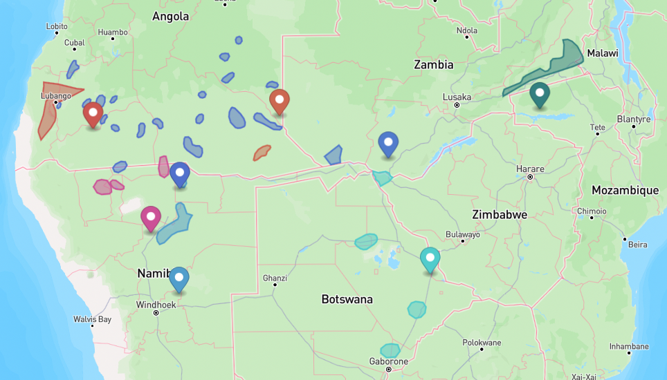
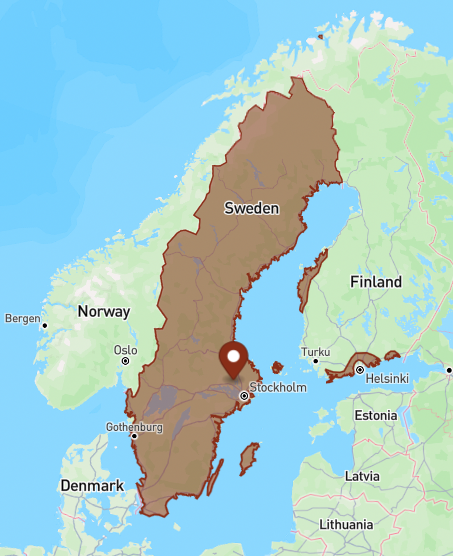

# Validation

Since this `cldfbench`-curated repository is used to create two CLDF datasets, we also have to run
the validation procedures on two sets.


## The *traditional* areas

First, we make sure the output is a valid CLDF dataset, i.e. data passes the type checks and foreign
keys meet referential integrity requirements:
```shell
cldf validate cldf/traditional
```

Next, we make sure all GeoJSON objects marked as speaker areas have valid geometries according to the 
[Simple Features standard](https://en.wikipedia.org/wiki/Simple_Features) (invalid geometries may
prevent operating on the geometries, e.g. computing distances, intersections, etc.):
```shell
cldfbench geojson.validate cldf/traditional
```


### Glottolog distance

To validate how well the speaker areas in the dataset correspond to "reality", we use Glottolog's point
coordinates for languages and compute the distances between speaker areas assigned to a language from
the corresponding point. This can be done by running a command from the [`cldfgeojson`](https://github.com/cldf/cldfgeojson)
package. We convert the resulting tab-separated table to proper CSV using the `csvformat` command from the
`csvkit` package and store the results in [etc/traditional/glottolog_distance.csv](etc/traditional/glottolog_distance.csv).
```shell
cldfbench geojson.glottolog_distance cldf/traditional --format tsv | csvformat -t > etc/traditional/glottolog_distance.csv
```
The results can be summarized using `csvstat`:
```shell
$ csvstat -c Distance,Contained etc/traditional/glottolog_distance.csv
  2. "Distance"

        Type of data:          Number
        Contains null values:  False
        Smallest value:        0
        Largest value:         11.238
        Most common values:    0 (2805x)

  3. "Contained"

        Type of data:          Boolean
        Contains null values:  False
        Most common values:    True (2487x)
                               False (1884x)

Row count: 4371
```
So, out of 4371 speaker areas which are matched to a Glottolog language with point coordinate
- 2805 had a distance of 0 which means the point coordinate was contained either in the area or
  in the convex hull of the area and
- 2487 speaker areas contained the point coordinate properly.

The largest reported distance is about 11.24 *grid units* in the Cartesian plane, i.e. about 1,200km
close to the equator. Clearly, the same language being located at places 1,200km apart seems suspicious.
Thus, we investigated outliers with regards to Glottolog distance and put explainable cases into an
"allowlist" at [etc/glottolog_distance_known.csv](etc/glottolog_distance_known.csv).

Let's inspect the unexplained cases with distance >= 1 grid unit. We can do this using a couple of commands
from the `csvkit` package: We first 
- join the "allowlist" to the table of distances, then
- filter cases with distance > 1 (i.e. distance not starting with the string `0.`)
- which are unexplained (i.e. with no `note` in the "allowlist").

We sort the result by distance, select only the `ID` and `Distance` columns and pipe the result into the
`termgraph` command:
```shell
csvjoin --left -c ID etc/traditional/glottolog_distance.csv etc/glottolog_distance_known.csv | csvgrep -c Distance -r"^0\.?" -i | csvgrep -i -c note -r".+" | csvsort -c Distance | csvcut -c ID,Distance | csvformat -E | termgraph

rung1258: ▇▇▇▇▇▇▇▇▇▇▇▇▇▇▇▇▇▇▇▇▇▇▇▇▇ 1.00 
ngoc1235: ▇▇▇▇▇▇▇▇▇▇▇▇▇▇▇▇▇▇▇▇▇▇▇▇▇ 1.01 
...
swah1253: ▇▇▇▇▇▇▇▇▇▇▇▇▇▇▇▇▇▇▇▇▇▇▇▇▇▇▇▇▇▇▇▇▇▇▇▇▇▇▇▇▇▇▇▇▇▇▇▇▇ 1.99 
deng1250: ▇▇▇▇▇▇▇▇▇▇▇▇▇▇▇▇▇▇▇▇▇▇▇▇▇▇▇▇▇▇▇▇▇▇▇▇▇▇▇▇▇▇▇▇▇▇▇▇▇▇ 1.99 
```
So there are no unexplained distances >2 grid units, i.e. about 200km close to the equator.

A distance of 200km still seems like a lot. So let's look at these cases on the map.
We can create a GeoJSON file containing speaker areas with Glottolog distance >= 1 and the corresponding Glottolog
point coordinate using the `geojson.geojson` command from the `cldfgeojson` package:
```shell
csvjoin --left -c ID etc/traditional/glottolog_distance.csv etc/glottolog_distance_known.csv | csvgrep -c Distance -r"^0\.?" -i | csvgrep -i -c note -r".+" | csvsort -c Distance | csvcut -c ID | cldfbench geojson.geojson --glottolog-version v5.1 cldf/traditional -  > etc/traditional/glottolog_distance_outliers.geojson
```

The resulting [GeoJSON file](etc/traditional/glottolog_distance_outliers.geojson) can be inspected using tools like QGIS, or https://geojson.io
Often, Glottolog distances > 0 can be explained by fractured speaker areas, with Glottolog using some kind of midpoint for its point coordinate,
as can be seen here




### MultiPolygon spread

The above method cannot detect cases where multiple ``raw`` shapes (e.g. for different dialects of a language)
have been aggregated to a multi-polygon with one shape being correctly matched to Glottolog, but others not,
because this would be reported as distance 0. Thus, we use a second method that computes how spread out
polygons in a multi-polygon area are. Big spread may be an indication of incorrect Glottolog matches.

To compute the spread of polygons in multi-polygon shapes we run another command of the `cldfgeojson` package
and store the results in [etc/traditional/multipolygon_spread.csv](etc/traditional/multipolygon_spread.csv).
```shell
cldfbench geojson.multipolygon_spread cldf/traditional --format tsv | csvformat -t > etc/traditional/multipolygon_spread.csv
```

Again, big spread does not necessarily mean an error. E.g. languages spoken by nomadic people in Siberia are
often reported in multiple disjoint areas which can spread over enormous distances. Thus, we again investigated
outliers and listed explainable cases in an "allowlist" at [etc/multipolygon_spread_known.csv](etc/multipolygon_spread_known.csv).

We summarize the unexplained cases in a similar way to above
```shell
csvjoin --left -c ID etc/traditional/multipolygon_spread.csv etc/multipolygon_spread_known.csv | csvgrep -c Spread -r"^0\.?" -i | csvgrep -i -c note -r".+" | csvsort -c Spread | csvcut -c ID,Spread | csvformat -E | termgraph

...
chuk1273: ▇▇▇▇▇▇▇▇▇▇▇▇▇▇▇▇▇▇▇▇▇▇▇▇▇▇▇▇▇▇▇▇▇▇▇▇▇▇▇▇▇▇▇▇▇▇▇▇▇ 3.92 
swed1254: ▇▇▇▇▇▇▇▇▇▇▇▇▇▇▇▇▇▇▇▇▇▇▇▇▇▇▇▇▇▇▇▇▇▇▇▇▇▇▇▇▇▇▇▇▇▇▇▇▇ 3.93 
viet1252: ▇▇▇▇▇▇▇▇▇▇▇▇▇▇▇▇▇▇▇▇▇▇▇▇▇▇▇▇▇▇▇▇▇▇▇▇▇▇▇▇▇▇▇▇▇▇▇▇▇▇ 3.96 
```
confirming no unexplained spread > 4.

Again, we can create a [GeoJSON file](etc/traditional/multipolygon_spread_outliers.geojson) containing multi-polygons with spread >= 3 for further investigation:
```shell
csvjoin --left -c ID etc/traditional/multipolygon_spread.csv etc/multipolygon_spread_known.csv | csvgrep -c Spread -r"^([012])\.?" -i | csvgrep -i -c note -r".+" | csvsort -c Spread | csvcut -c ID | cldfbench geojson.geojson --glottolog-version v5.1 cldf/traditional -  > etc/traditional/multipolygon_spread_outliers.geojson
```
Cases with big spread can often be explained as speaker areas on mulitple islands.



Smaller spread can still be a reason of incorrect Glottolog matching. Thus, we investigate multi-polygons with spread >=1, but leave out cases where the shape consists of more than 2 polygons (effectively leaving out very fractured speaker areas).
```shell
csvjoin --left -c ID etc/traditional/multipolygon_spread.csv etc/multipolygon_spread_known.csv | csvgrep -c Spread -r"^0\.?" -i | csvgrep -i -c note -r".+" | csvgrep -c NPolys -r"^([12])$" | csvsort -c Spread | csvcut -c ID | cldfbench geojson.geojson --glottolog-version v5.1 cldf/traditional -  > etc/traditional/multipolygon_spread_outliers_2.geojson
```
[Cases where a speaker area consists of two polygons](etc/traditional/multipolygon_spread_outliers.geojson), with the Glottolog coordinate somewhere between these can generally be
regarded as unproblematic.


## The *contemporary* areas

Run CLDF validation and validation of geometries:
```shell
cldf validate cldf/contemporary
cldfbench geojson.validate cldf/contemporary
```

### Glottolog distance

Compute distances of language-level speaker areas to corresponding Glottolog point coordinate:
```shell
cldfbench geojson.glottolog_distance cldf/contemporary --format tsv | csvformat -t > etc/contemporary/glottolog_distance.csv
```

Print the unexplained cases with distance >= 1 grid unit:
```shell
csvjoin --left -c ID etc/contemporary/glottolog_distance.csv etc/glottolog_distance_known.csv | csvgrep -c Distance -r"^0\.?" -i | csvgrep -i -c note -r".+" | csvsort -c Distance | csvcut -c ID,Distance | csvformat -E | termgraph
```
Make sure there are no distances > 10.

Distances can generally be explained by displacement of populations during colonialism.
```shell
csvjoin --left -c ID etc/contemporary/glottolog_distance.csv etc/glottolog_distance_known.csv | csvgrep -c Distance -r"^(0|1)\.?" -i | csvgrep -i -c note -r".+" | csvsort -c Distance | csvcut -c ID | cldfbench geojson.geojson --glottolog-version v5.1 cldf/contemporary -  > etc/contemporary/glottolog_distance_outliers.geojson
```
see for example Glottolog's point coordinate for Ojibwe in relation to the Ojibwe reservations in Minnesota:


### MultiPolygon spread

```shell
cldfbench geojson.multipolygon_spread cldf/contemporary --format tsv | csvformat -t > etc/contemporary/multipolygon_spread.csv
```

```shell
csvjoin --left -c ID etc/contemporary/multipolygon_spread.csv etc/multipolygon_spread_known.csv | csvgrep -c Spread -r"^0\.?" -i | csvgrep -i -c note -r".+" | csvsort -c Spread | csvcut -c ID,Spread | csvformat -E | termgraph
```
There should be no unexplained spread > 4.

Investigate multi-polygons with spread >= 3:
```shell
csvjoin --left -c ID etc/contemporary/multipolygon_spread.csv etc/multipolygon_spread_known.csv | csvgrep -c Spread -r"^([012])\.?" -i | csvgrep -i -c note -r".+" | csvsort -c Spread | csvcut -c ID | cldfbench geojson.geojson --glottolog-version v5.1 cldf/contemporary -  > etc/contemporary/multipolygon_spread_outliers.geojson
```
These generally "make sense", i.e. correspond to spread-out languages.

Investigate multi-polygons with spread >=1, consisting of only 2 polygons:
```shell
csvjoin --left -c ID etc/contemporary/multipolygon_spread.csv etc/multipolygon_spread_known.csv | csvgrep -c Spread -r"^0\.?" -i | csvgrep -i -c note -r".+" | csvgrep -c NPolys -r"^([12])$" | csvsort -c Spread | csvcut -c ID | cldfbench geojson.geojson --glottolog-version v5.1 cldf/contemporary -  > etc/contemporary/multipolygon_spread_outliers.geojson
```
These also look reasonable.

